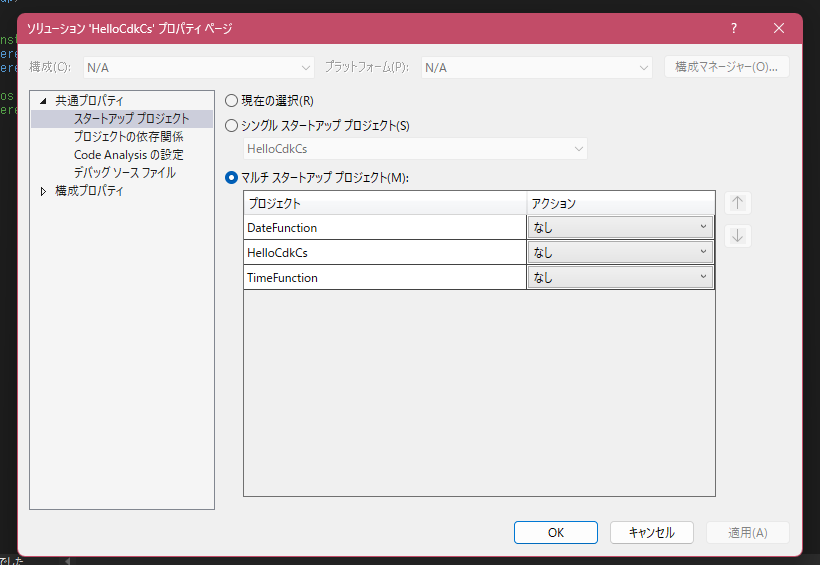

# Welcome to your CDK C# project!

This is a blank project for CDK development with C#.

The `cdk.json` file tells the CDK Toolkit how to execute your app.

It uses the [.NET CLI](https://docs.microsoft.com/dotnet/articles/core/) to compile and execute your project.

## Useful commands

* `dotnet build src` compile this app
* `cdk deploy`       deploy this stack to your default AWS account/region
* `cdk diff`         compare deployed stack with current state
* `cdk synth`        emits the synthesized CloudFormation template

---

## Bulid Command

ソリューション -> プロパティ -> スタートアッププロジェクト -> マルチスタートアッププロジェクト に変更

> $hello-cdk-cs>dotnet publish src -c Release -r linux-x64 -p:PublishReadyToRun=false --self-contained

[reference](https://davidpallmann.hashnode.dev/hello-cdk)